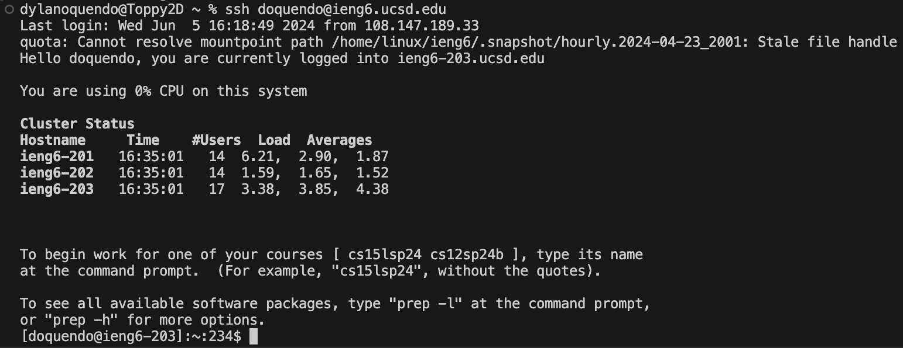
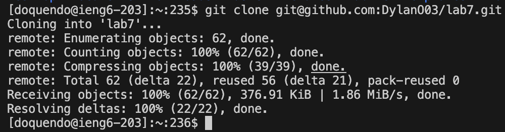
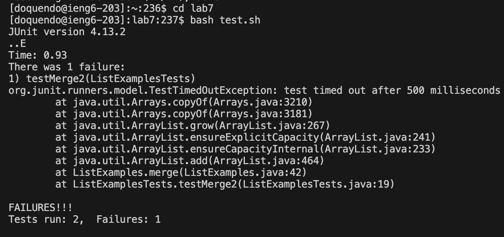
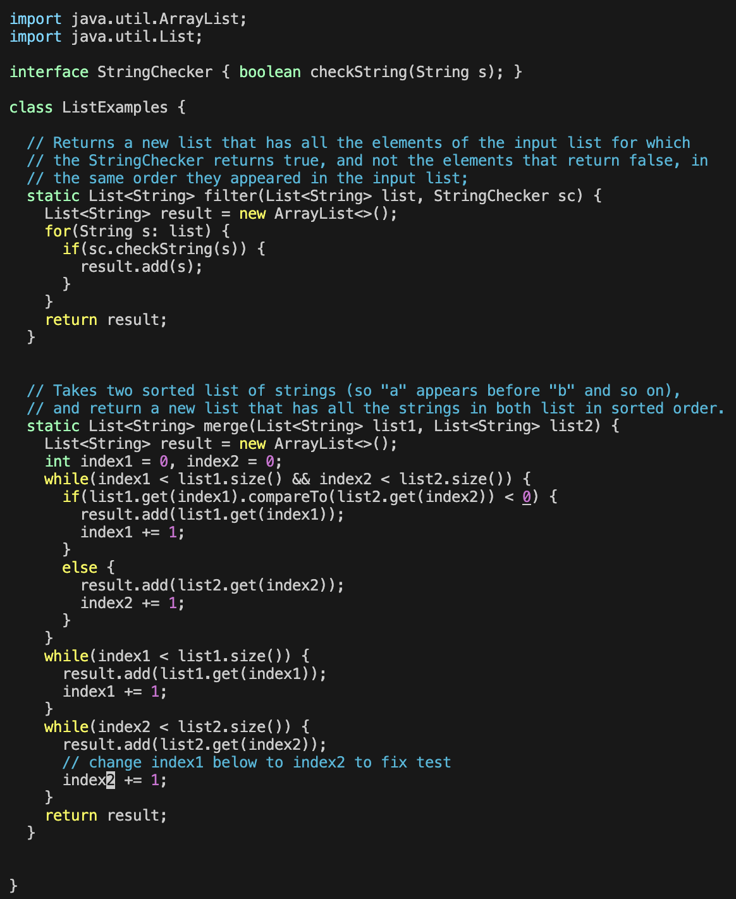
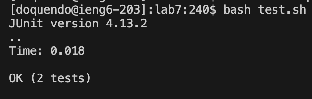
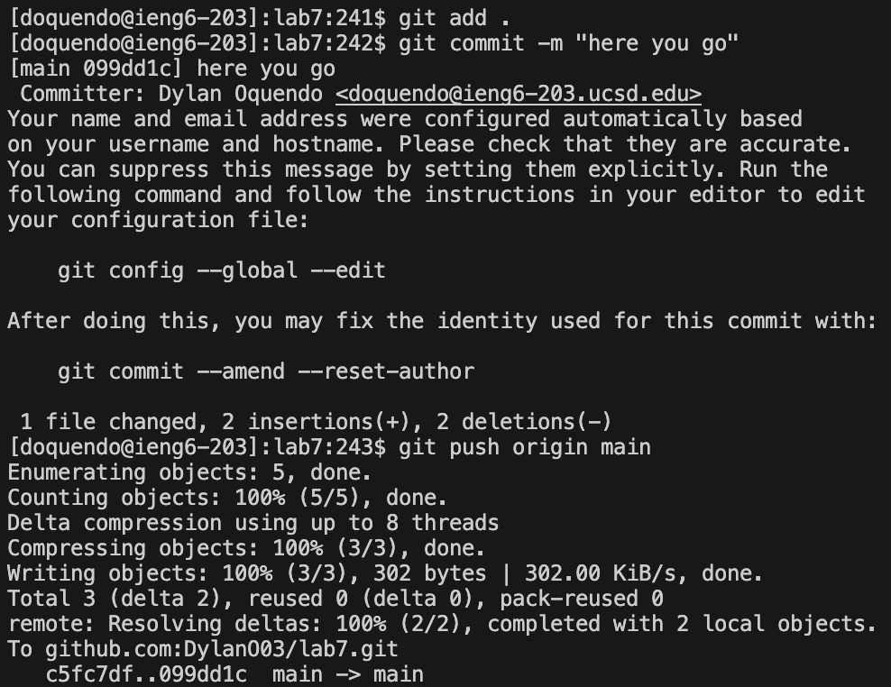

# Vim
  #### Step 4:  
  
  I typed: ssh`<space>`doquendo@ieng6.ucsd.edu`<enter>`. This allowed me to login to the  
  remote computer via previously set up keys.

  #### Step 5:  
  
  I pressed: `<up><up><up><up><enter>` as "git clone git@github.com:DylanO03/lab7.git"  
  was saved 4 up in the search history, this command clones the repo using ssh.

  #### Step 6:  
  
  I typed: cd`<space>`lab7`<enter>`. Which changed directory to the new directory lab7 I  
  cloned. Then I typed: bash`<space>`test.sh`<enter>`, this executed the bash  
  file in the lab7 dir, that runs the tests in the "ListExamplesTests.java" file, which test  
  the code in the "ListExamples.java" file, both of which are also located in lab7. The bash  
  file works by compiling and running the test file with the appropriate JUnit path so that  
  the JUnit tests can run.

  #### Step 7:  
  
  I typed: vim`<space>`ListExamples.java`<enter>`. Which brought me into the vim editor for  
  the java file. Then I typed: xxx29+`<right><right><right><right><right>`xi2`<esc><shift>`zz  
  The x's deleted the unnecessary part of the arraylist add, then 29+ went down 29 lines from  
  where I started, which puts me on the line to fix the mismatched index variable, so I go  
  over to the right to the number, then delete it, go into edit mode, replace it with the  
  correct number: 2, then return to normal mode, and ZZ to save and exit.

  #### Step 8:  
  
  I pressed: `<up><up><up><enter>` as "bash test.sh" was saved 3 up in the search history,  
  this reruns the tests from step 6, but with now "ListExamples.java" has changes to it.

  #### Step 9:  
  
  I typed: git`<space>`add`<space>`.`<enter>`. This stages the changes for commiting, then  
  I typed: git`<space>`commit`<space>`-m`<space>`"here`<space>`you`<space>`go"`<enter>`.  
  This commits the changes to the repo. Then I typed: git`<space>`push`<space>`origin`<space>`main`<enter>`.  
  This last bit pushes the changes back to orginal repo this was cloned from on the main branch.
